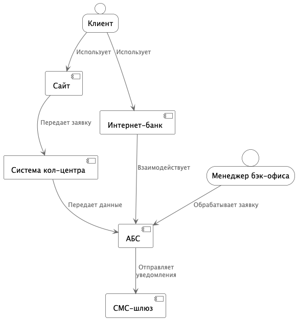
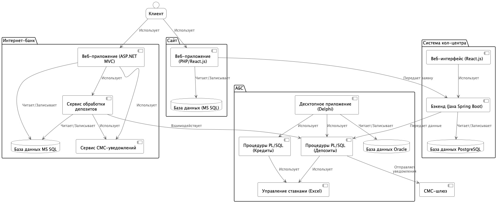

### **Название задачи:** Открытие депозитов онлайн (MVP)
### **Автор:**
### **Дата:**
### **Функциональные требования**

| **№** | **Действующие лица или системы** | **Use Case** | **Описание** |
|:-----:|:---------------------------------|:-------------|:-------------|
| 1 | Клиент | Просмотр списка депозитов | Клиент видит список доступных депозитов с актуальными ставками на сайте и в интернет-банке. |
| 2 | Клиент | Подача заявки через сайт | Клиент подает заявку на депозит, указывая Ф.И.О. и номер телефона. |
| 3 | Клиент | Подача заявки через интернет-банк | Клиент подает заявку на депозит, указывая счет и сумму. |
| 4 | Интернет-банк | Отображение персонализированных ставок | Интернет-банк отображает персонализированные ставки для клиента. |
| 5 | Интернет-банк | Подтверждение операции | Клиент подтверждает операцию открытия депозита с помощью СМС-кода. |
| 6 | Менеджер бэк-офиса | Обработка заявки | Менеджер бэк-офиса обрабатывает заявку на открытие депозита. |
| 7 | АБС | Подтверждение условий | Менеджер подтверждает условия депозита в АБС банка. |
| 8 | СМС-шлюз | Отправка уведомлений | Клиент получает СМС-уведомления после подтверждения ставки и открытия депозита. |

### **Нефункциональные требования**

| **№** | **Требование** |
|:-----:|:---------------|
| 1 | Удобный и интуитивно понятный интерфейс. |
| 2 | Соблюдение фирменного стиля. |
| 3 | Быстрый отклик на операции (миллисекунды). |
| 4 | Доступность сервисов 24/7 и 99,9%. |
| 5 | Защита передачи данных (шифрование). |
| 6 | Резервный ЦОД для интернет-банка. |
| 7 | Горизонтальное масштабирование интернет-банка. |
| 8 | Вертикальное масштабирование АБС. |
| 9 | Использование существующих технологий (MS SQL, Oracle). |
| 10 | Совместимость новых технологий. |
| 11 | Избегать прямой работы интернет-банка с API АБС. |
| 12 | Разграничение доступа к данным. |

### **Решение**

#### Диаграмма контекста

#### Диаграмма контейнеров

**Логика принятия решений:**

* Использовать микросервисную архитектуру для сервиса обработки депозитов в интернет-банке, чтобы обеспечить масштабируемость и независимость.
* Избегать прямой работы интернет-банка с API АБС, используя промежуточный сервис или очередь сообщений (например, Kafka в перспективе).
* Использовать существующие технологии (MS SQL, Oracle) для минимизации изменений и затрат.
* Реализовать сервис СМС-уведомлений в интернет-банке, чтобы избежать доработок ядра системы подрядчиком.
* Использовать шифрование трафика для защиты передачи данных.

### **Альтернативы**

* Прямая интеграция интернет-банка с API АБС:
    * Недостатки: риск перегрузки АБС, нарушение требований доступности.
* Использование другой платформы для микросервисов (например, Kubernetes):
    * Недостатки: Внедрение Kubernetes потребовало бы обучения персонала и дополнительных затрат, что делает его альтернативным решением.

**Недостатки, ограничения, риски**

* Необходимость миграции данных из Excel-файлов в АБС для управления ставками.
* Возможные сложности с интеграцией микросервиса с существующей платформой интернет-банка.
* Риск недостаточной производительности АБС при увеличении нагрузки.
* Зависимость от подрядчика для обновления ядра интернет-банка.

