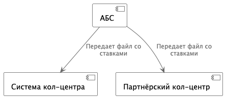
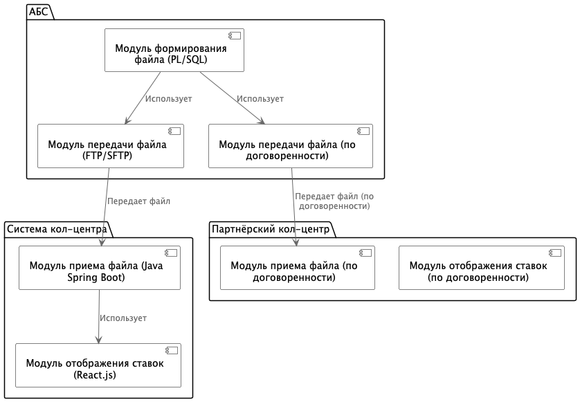

### **Название задачи:** Передача ставок в кол-центр
### **Автор:**
### **Дата:**
### **Функциональные требования**

| **№** | **Действующие лица или системы** | **Use Case** | **Описание** |
|:-----:|:---------------------------------|:-------------|:-------------|
| 1 | Система кол-центра | Получение актуальных ставок | Система кол-центра получает актуальные ставки по депозитам. |
| 2 | Партнёрский кол-центр | Получение актуальных ставок | Партнёрский кол-центр получает актуальные ставки по депозитам. |
| 3 | АБС | Формирование файла со ставками | АБС формирует файл с актуальными ставками по депозитам. |
| 4 | АБС | Передача файла в кол-центр | АБС передает файл со ставками в систему кол-центра. |
| 5 | АБС | Передача файла в партнёрский кол-центр | АБС передает файл со ставками в систему партнёрского кол-центра. |

### **Нефункциональные требования**

| **№** | **Требование** |
|:-----:|:---------------|
| 1 | Актуальность ставок в кол-центрах. |
| 2 | Надежность передачи данных. |
| 3 | Безопасность передачи данных. |
| 4 | Минимизация изменений в существующих системах. |
| 5 | Учет ограничений партнёрского кол-центра (получение файлов). |

### **Решение**

#### Диаграмма контекста 

#### Диаграмма компонентов

**Логика принятия решений:**

* Использовать АБС для формирования файла, так как она содержит актуальные данные.
* Передавать файлы через FTP/SFTP для системы кол-центра и по договоренности для партнёрского кол-центра.
    - Передача файлов через защищенный файловый ресурс.
    - Передача файлов через электронную почту (с шифрованием).
    - Другой способ, согласованный с партнёром.
* Разработать модуль приема и отображения ставок в системе кол-центра.

### **Альтернативы**

* API-вызовы для передачи ставок:
    * Недостатки: невозможность для партнёрского кол-центра.
* Обмен данными через общую базу данных:
    * Недостатки: риски безопасности, сложность реализации.

**Недостатки, ограничения, риски**

* Задержка обновления ставок при передаче файлов.
* Риск ошибок при ручной обработке файлов в партнёрском кол-центре.
* Необходимость обеспечения безопасности при передаче файлов.

### **Список крупных задач:**

**АБС:**

1.  Разработка модуля формирования файла со ставками (PL/SQL).
2.  Разработка модуля передачи файла в систему кол-центра (FTP/SFTP).
3.  Разработка модуля передачи файла в партнёрский кол-центр (по договоренности).

**Система кол-центра:**

1.  Разработка модуля приема файла со ставками (Java Spring Boot).
2.  Разработка модуля отображения ставок для операторов (React.js).

**Партнёрский кол-центр:**

1.  Разработка модуля приема файла со ставками (по договоренности).
2.  Разработка модуля отображения ставок для операторов (по договоренности).

